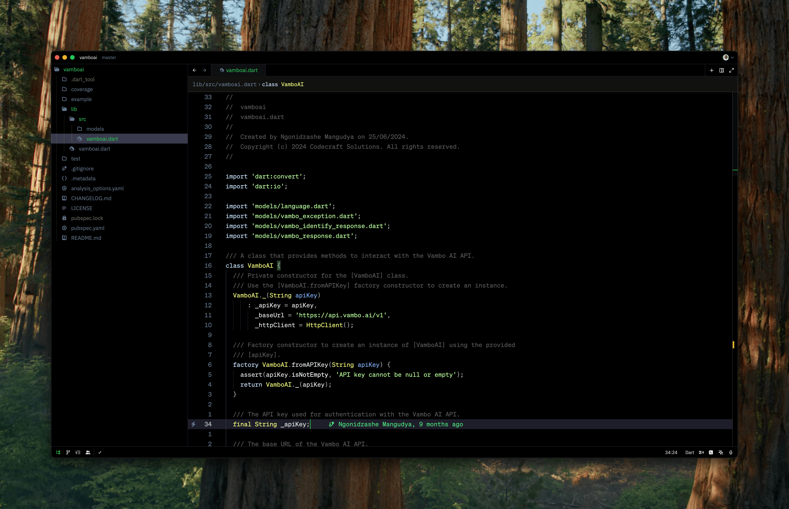

# Midnight Harbor

A sophisticated dark theme inspired by the tranquil depths of midnight waters. Midnight Harbor combines deep blues, subtle purples, and crisp whites to create an elegant coding environment that reduces eye strain during long development sessions. Perfect for developers who appreciate a modern, professional aesthetic with carefully balanced contrast and thoughtfully chosen accent colors.

## Sponsor

The theme is `developed` by [Ngonidzashe](https://www.buymeacoffee.com/modestnerd), an open-source enthusiast and developer.
